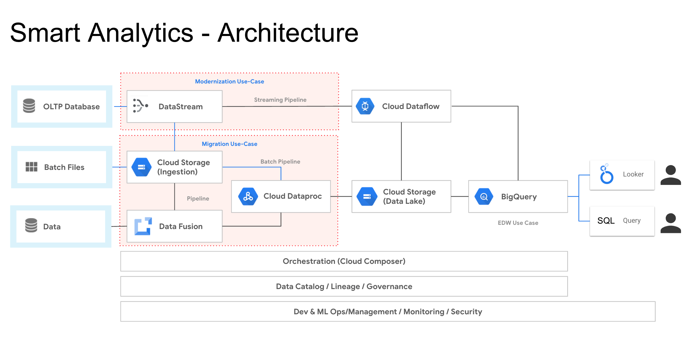
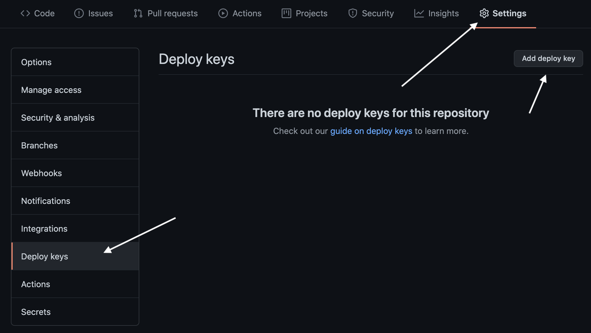
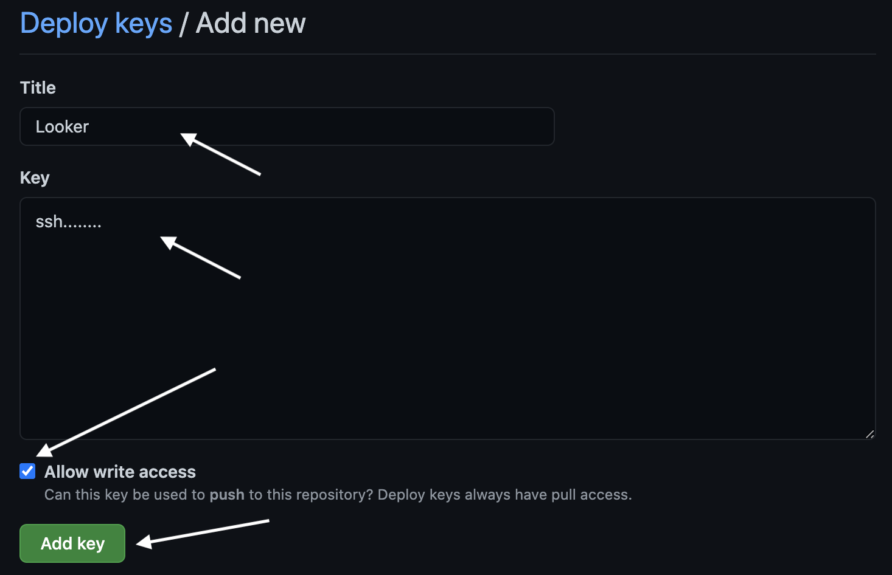
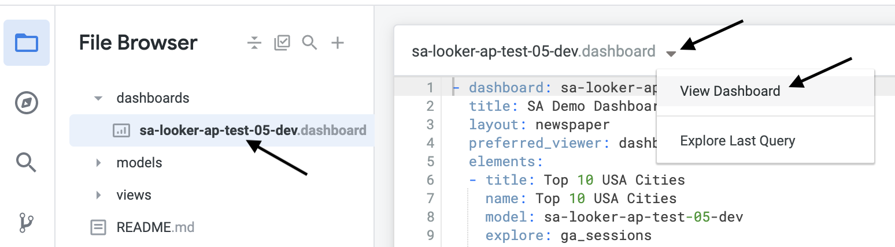
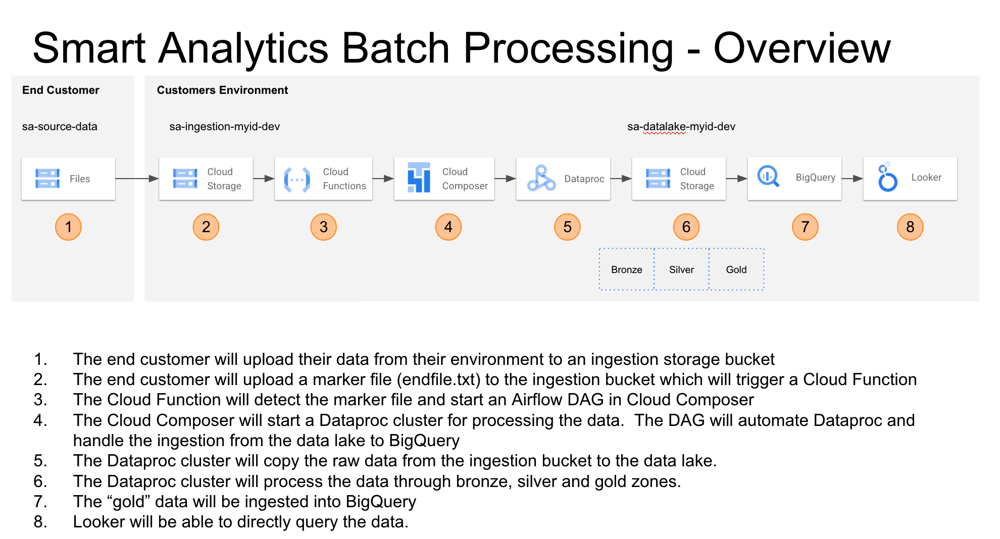
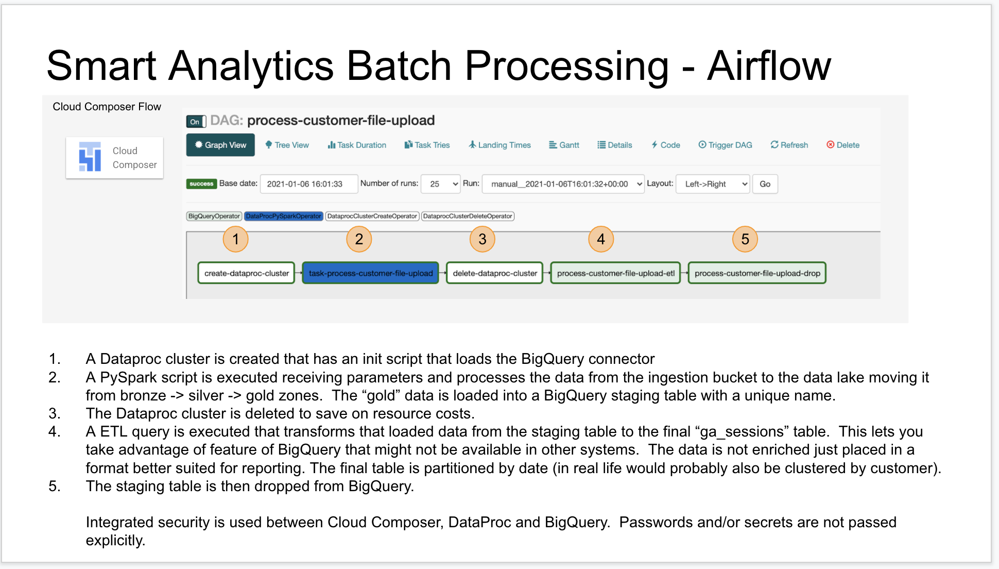
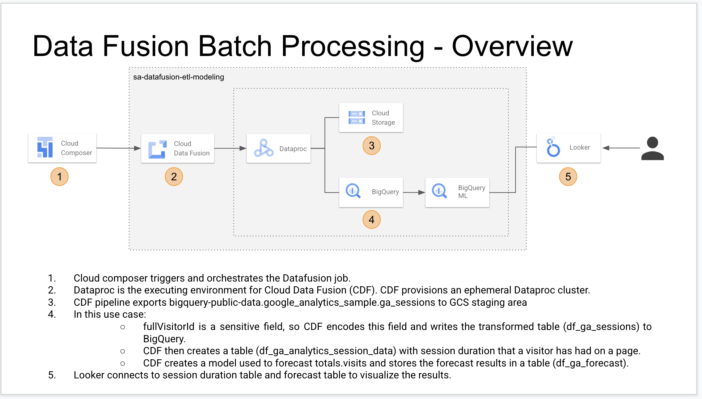
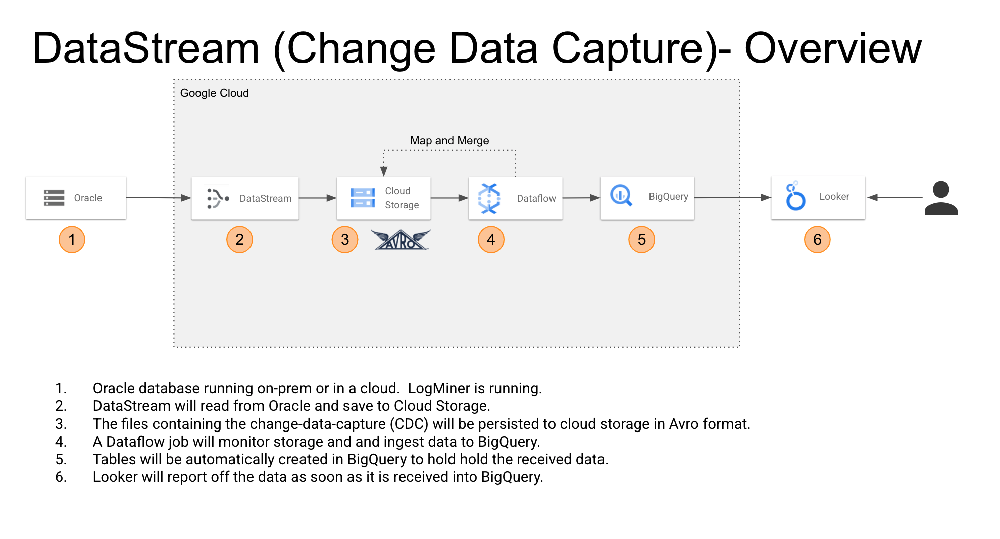
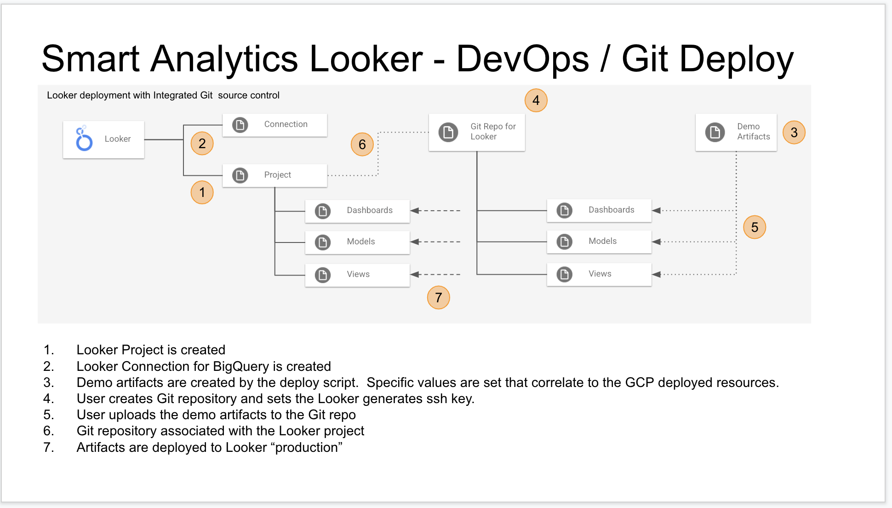

# GCP-Smart-Analytics
This project is a complete end-to-end deployable demo for showing customers a working example of big data / smart analytics in the Google Cloud.  The project creates all the resources via scripts / DevOps and has everything from sample data to sample reports.  The entire demo can be deployed by running a single script.  The code is sharable with customers so they can deploy into their GCP environment.  This is designed to provide customers a head start in building a complete end to end architecture and devops code.


## Diagram



## Prerequisites
What do you need to deploy this?
- A GCP Project (create manually via the GCP Cloud Console)

- A Service Account created with **Owner** access (create manually via the GCP Cloud Console)
    - You need to create a key and download the file
- If using argolis override org policy for the project back to default until the project is updated to work with the current restrictions.
- Google Cloud Shell
    - If you want to run from your personal machine you need the following installed
        - Bash (tested on Mac)
            - TO DO: Verify the script runs on Linux
        - gcloud CLI
            - https://cloud.google.com/sdk/docs/install
        - gsutil CLI
            - https://cloud.google.com/storage/docs/gsutil_install
        - bq CLI
            - https://cloud.google.com/bigquery/docs/bq-command-line-tool
        - jq installed (for JSON parsing)
            - https://stedolan.github.io/jq/download/

- Looker Environment with Admin access (Optional)
    - A client id and secret for calling the Looker REST API (created manually via Looker portal)
    - You will need to create a JSON file to hold these values
        - ```{ "client_id": "REPLACE-ME", "client_secret": "REPLACE-ME" }```
    - NOTE: Looker is "optional" and if you do not want to configure comment out the Looker lines in the main-deploy.sh

- GitLab or GitHub account with Admin access (only required if deploying Looker)
    - A personal account is fine for testing


## To create the demo/environment

### Create GCP Project
- In the Google Cloud Console
- Create a new Project
- Pick a meaningful name
- The below text will reference the name as **my-data-project**


### GCP Service Account
- In the Google Cloud Console
- On the left hand menu select "IAM & Admin"
- On the sub-menu select "Service Accounts"
- On the top click "Create Service Account"
- Enter an account name
    - HINT: Name id **my-data-project**-devops
- Click "Create"
- For "Select a role"
- Select "Owner" under Basic
- Click "Continue"
- Click "Done"
- Click on your new Service Account
- Click "Add Key" | "Create new key"
- Select JSON
- Select "Create"
- NOTE: 
    - This file will be download to your machine. You will need it for the below steps.  You can rename it to **my-data-project**-devops.json to make it easier to type in later steps.
    - Your should keep this out of source control.


### Looker GitHub Repository (only required if you are deploying Looker)
- Go to GitHub and create a new repository
    - HINT: Name your repository the same name as your GCP project (e.g. **my-data-project**)
- Click on "Settings" (On the code menu)
- Click on "Branches" (On the left hand menu)
- If your branch is named "master" then you are done
- If your branch is named "main" the you need to click the pencil icon and rename it to "master"


### GCP resources
- Open the Google Cloud Console (or you can do this in a different tab: https://shell.cloud.google.com/)
- You will be in your home directory
- Upload your GCP service account credential file
    - Click the vertical "..." in the top right of cloud console and select upload file
    - Upload your service credential "**my-data-project**-devops.json"
- Clone this repository
    - ```git clone https://github.com/adampaternostro/GCP-Smart-Analytics.git```
- Change to the directory
    -  ```cd GCP-Smart-Analytics```
- Click the "Open Editor" in the Cloud Console 
    - If you are in a In Private browser then click "Open in new window".  This makes things easier since you can keep the editor open.
- If you are deploying Looker
    - Select the file looker-username-password.json
    - Log into Looker
        - You need to create login to Looker under Admin | Users | select your account | API3 Keys.  
    - Replace the REPLACE-ME with your values. 
    - Save looker-username-password.json

- Select the file main-config.json and enter these values
    - ```project```
        - The ID of your Google Cloud Project
        - EXAMPLE: "my-data-project"

    - ```GOOGLE_APPLICATION_CREDENTIALS```: 
        - Full path (not relative) to your exported service credentials.
        - EXAMPLE: "/folder/folder/**my-data-project**-devops.json"

    - ```environment```
        - A unique name that will not clash with other deployments
        - EXAMPLE: "myid-dev"
        - HINT: The "myid" should be a customer name (e.g. acmeinc) or project name (e.g. megaworkload)
        - HINT: The "-dev" is used as a suffix for DevOps.  
            - The reason for the "-dev" is for deployments to QA/Prod (e.g. "acmeinc-dev", "acmeinc-qa", "acmeinc-prod")
            - Customers will typically have some type of naming convention to tell their environments apart.
        
    - ```looker_customer_id```: You Looker customer id (part of your URL).
        - EXAMPLE: "googlecloud"
        - HINT: This will be part of your Looker URL (e.g. https://googlecloud.looker.com)
        - NOTE: If you are not deploying Looker, then leave this value as empty string.

    - ```LOOKER_APPLICATION_CREDENTIALS``` Path to your service credentials for Looker
        - Full path (not relative) to your Looker API credentials.
        - EXAMPLE: "/folder/folder/looker-username-password.json"
        - NOTE: If you are not deploying Looker, then leave this value as empty string.
        - NOTE: If you are deploying the smart analytics demo for many customers, you can use the same values for many Looker deployments.  

    - ```looker_git_remote_url```: ssh key for the Looker Git integration authentication
        - EXAMPLE: "git@github.com:**YOUR-GIT-ACCOUNT-NAME**/**my-data-project**.git"
        - NOTE: If you are not deploying Looker, then leave this value as empty string.

    - ```looker_origin``` master branch origin
        - EXAMPLE: "origin/master"
        - **ALERT** If you are using GitHub, GitHub now creates a Main branch instead of Master.  You should rename your Main to Master.  Looker is still looking for master and the name main might cause issues.
        - NOTE: If you are not deploying Looker, then leave this value as empty string.

    - ```oracle_install_zip``` the location of the install in a bucket in the same GCP project
        - EXAMPLE: "gs://sa-demo-cdc/V839960-01.zip".  **You will need to create a bucket in your GCP project, download Oracle and copy the install to the bucket.**
        - NOTE: If you are not deploying DataSteam, then leave this value as empty string.        
        - NOTE: DataStream, at the time of this writing, is in alpha/beta so you will need your GCP project whitelisted.
        - NOTE: If you are deploy to a subscription that has an automated enforcer that removes firewall rules then you need to beaware of that process.  You might need to request an exemption from your IT department since firewall rules are required for public IP address.  Using VPCs might be an option in the future.
        - **ALERT** Oracle version 12.2.0.1 has been hardcoded into this project!  Please change the ./DataStream/oracle-install.sh file if you download a different version.
        - **ALERT** You will need to manually enable the API for datastream.  Search for DataStream and select "Enable API".  This manual step will be remove in GA.

    - Save main-config.json

- Click Open Terminal in the top menu of Cloud Console

- Run this command to set the execute permission on all "*.sh" files
   ```
   find . -type f -name "*.sh" -print0 | while IFS= read -r -d '' file; do
   echo "Setting execute permission on: $file"
   chmod +x $file
   done
   ```

- Run: ```./main-deploy.sh main-config.json```
    - NOTE: You might get a popup asking to Authorize your GCP interaction.  Press "Authorize"
    - NOTE: If you Cloud Shell times out then you can simply re-run the script (Cloud Shell might timeout when waiting for the Git configuration if you run the script and walkaway during the deployment)
    - NOTE: Data Fusion does not always import the pipeline (./Datafusion/sa-datafusion-etl-ml-modeling.json).  You might have to import by hand since plugins can be different versions.  You will manually import and click "Fix issues".  The current script attempts to map to the latest versions.
    - TIP: If you are deploying this demo for many customers/projects you can have more than one main-config.json and just pass a different file to "main-deploy.sh" or just clone the Git repo to different paths.


#### When the deployment pauses:
- Configuring GitHub for Looker
    - The program will pause and tell you need to add upload your artifacts to Git and add a SSH key
    - In the Cloud Console, click "+" sign to open a new tab
    - Click the "Open Editor" in the Cloud Console 
    - To add the SSH key
        - Open the file "looker-ssh-key-**${environment}**.txt" in the Editor
        - Copy the contents of the file to the clipboard
        - Open GitHub
            - Select the repository you created
            - Click: "Settings" | "Deploy Keys" | "Add Deploy Key"
            
            - Paste the SSH into the body
            - Name it Looker
            - **Check** the checkbox "Allow write access"
            - Click "Add Key"
            
    - To add the Looker artifacts
        - In the Editor explore the folders on the left
        - Locate the folder "Looker/sa-looker-git-files"
        - GOAL: You need upload the folders "dashboards", "models" and "views" to your Git repo
        - Right click on the folder and select "download"
        - A "tar" file will be downloaded to your local machine
        - You can upload these to GitHub in one of two ways:
            1. Manually (Easy way)
                - In GitHub click the "Add file" | "Upload files" button
                - Drag each folder ("dashboards", "models" and "views") into the provide file upload area
                - Click "Commit Changes"
            2. Clone your repo to your local machine, etc. (Advanced Git users)
                - Typically you would clone the repo on your local machine with VS code
                - Un-tar the file
                - Add the 3 folders to the project
                - Check in your code
                - Push to GitHub

#### Checking the deployment
- The deployment uploads a files and kicks off processing
- You should see an Airflow DAG start which will start a Dataproc cluster, populate the data lake with folders, create data in BigQuery 
- You should also be able to kick off the Data Fusion DAG
- For complete details on these steps read the below topics
- Login into Looker:
    - Click on Develop and select your project
    - You might need to pull the files from master to your branch
      
    - Click on the dashboard and then click the small down arrow to view the report
      


#### What if the deployment is broke
- Run the main-deploy.sh script again
- If all else fails, create a new GCP project, service account and Git repo and try again.  Contact the team to leave feedback if the failure is consisently fails.
- Review the debugging steps below


## To demo the batch processing 


You can run the batch processing during a demo in front of a customer.  This can be run over and over.  It will keep track of the days processed in a file named "dates-uploaded.txt".  You can delete this file to start processing all over again.  There is 30 days of data to run so you can run quite a lot before having to reset.  The month of June 2017 is used for this demo.
- ```./Customer-Upload/upload-files.sh main-config.json```
- Wait for the upload to complete
- On the main left menu select "Storage"
    - Click on the bucketed named "sa-ingestion-YOUR-ENVIRONMENT"
    - Click on the customer01 folder
    - Click on the ga_sessions folder
    - Click on the 2017-06-01 (or any date) folder
    - You are not viewing the files that got uploaded by an "end-customer".  You just simulated a customer's "customer" sending them data to process.
    - Note the end_file.txt.  This file triggers a Cloud Function to begin data processing.  A trigger file is used since we do not know how many files an end-customer might upload.

- On the main  menu select "Cloud Functions"
    -  Click on the name "customerUploadTrigger"
    -  Click on Logs (inner menu)
    -  You will see something like "BEGIN: Cloud Function Executing for File: customer01/ga_sessions/2017-06-01/end_file.txt.  The date part of the filename will match the uploaded data.
    - This means the Function has been triggered
    - The function will now trigger a Cloud Composer Airflow pipeline

- On the main left menu select "Composer"
    - Click on the "Airflow webserver" link to open a new tab
    - For the "process-customer-file-upload" DAG you should see it running.  Under DAG runs you should see a "1" running.  You can click on this for details.

- Go back to your Google Cloud Console tab

- On the main left menu select "Dataproc"
    - You will see a cluster being spun up by Airflow to process the uploaded data.  
        - NOTE: if you take to long with the customer the cluster could be shutdown by now....
    - Click on the Jobs and you should see job named something like "task-process-customer-file-upload_20210114_a387144f"
    - Click on the job
    - If you view the log output you can see details of the PySpark script that was run.
    - The data has been processed from the ingestion bucket to the data lake bucket.  The data has also been placed into bronze, silver and gold zones.  The data has also been sent to BigQuery.
    - Airflow will also shutdown the Dataproc cluster

- On the main left menu select "Storage"
    - Click on the bucketed named "sa-datalake-YOUR-ENVIRONMENT"
    - You can explore the bronze, silver and gold folders.  Note the data has been partitioned by date and converted from JSON to parquet.

- On the main left menu select "BigQuery"
    - Expand the dataset for your project
    - Expand the table ga_sessions
    - Click on the table
    - Note, it says the data is partitioned table.  The data was partitioned by day.
    - Click on Preview.  You will see the data loaded.

- Go back to your Airflow tab in your browser
    - Diagram
    
    - Click the Airflow icon in the top left to ensure you are on the home page
    - Click the DAG "process-customer-file-upload"
    - You should see the processes that were run.
    - There is one process named "process-customer-file-upload-etl" which does some BigQuery transforms from the parquet format.  All the data transformation should be done in the data lake, the BigQuery transforms should not enrich the data at this point, just place it in a BigQuery format for fast query speed.  The ga_sessions table uses structs and arrays for efficient querying.

- Open Looker in a new tab
    - Click on Develop on the Top menu
    - Select "Development Mode"
    - Click on Develop on the Top menu
    - Find your project and click on it, you should see "File Brower"
    - Expand the resources dashboards, models and views.  Explain the customer these were deployed via DevOps.
    - Click on the left hand menu "Git Actions" to show the DevOps integration
    - Click on the dashboards and you should see the Looker modeling code
    - You can also open your Git repo at this time and explain that Looker is deploying from Git
    - Cick on the left hand menu "File Browser"
    - Expand and click on your dashboard
    - There is a "small" down arrow at the top of the Looker ML click it and select "View Dashboard"


## To demo Data Fusion



- Login into the Google Cloud Console
- On the main left menu select "Composer"
    - Click on the "Airflow webserver" link to open a new tab
    - For the "process-datafusion-etl-ml-modeling" DAG press the "Play" icon (Trigger DAG)
    - Click Trigger (no parameters are needed)
    - After a few seconds you will need a circle with a 1 in it, you can hover over it and see the DAG running
- Go back to your Google Cloud Console tab
- On the main left menu select "Dataproc"
    - You will see a cluster being spun up for the Data Fusion job
- On the sub-left menu for Dataproc, click on jobs once the cluster has started.
    - You will see the Hadoop job created
- On the main left menu select "Storage"   
    - ???

## To demo Data Stream



- Login into the Google Cloud Console
- ... TBD

# DevOps

## Google Project (GCP) DevOps
- The deploy.sh script requires the following:
    1. A GCP project already created
    2. A service account created with owner access
    3. The service account exported to a json file
    4. An environment setting (e.g. dev, qa or prod)
- The script will:
    1. Set the names constructed so they include the environment setting 
    2. The script will login as the service account
    3. An access token will be generated for REST API calls to GCP
    4. A Cloud Deployment will occur via a Jinja template.
        - This will deploy:
        - A data lake bucket for holding the data lake
        - A ingestion bucket for customer upload of data to the system
        - A source bucket which is required for demo purposes, this will emulate a customer data
        - A Pub/Sub topic/subscription (NOT YET USED)
        - A BigQuery dataset for holding the data to be queried by Looker
    5. A Data Fusion instance will be created via REST
    6. BigQuery, Data Catalog and Cloud Composer APIs will be enabled
    7. Cloud Composer will be deployed
        - This will have the following environment variables set which are passed to Dataproc and BigQuery.
            - env_data_lake_bucket (e.g. gs://bucket-name)
            - env_ingestion_bucket (e.g. gs://bucket-name)
            - env_environment (e.g. my-id-dev)
            - env_zone (e.g. us-west2-a)
            - datafusion_location (e.g. us-west2)
            - datafusion_name (e.g. sa-datafusion-$environment)
        - The process customer file upload DAG will be - deploy which will automate the batch processing 
    8. A Cloud Function will be deployed.  This function will listen for the marker file in the ingestion bucket and will launch the Airflow DAG
    9. The data fusion pipeline will be deployed.  The pipeline will have its artifacts upgraded to match the version of the installed versions on the cluster.  Without this step the pipeline will not automatically deploy.  If the pipeline fails to deploy, try to manually import into data fusion to see if the UI shows any specific messages.


## Looker DevOps

- The deploy.sh script requires the following:
    1. Looker account, admin access and API keys
    2. A Git account (GitLab or GitHub)
- The script will:
    1. Set the API to developer mode
    2. Create a Looker Project
    3. Create a Looker Connection to BigQuery for the instance created by the GCP script
        - A new GCP service account will be created with the minimum required permissions
            - BigQuery Data Editor
            - BigQuery Job User
    4. Create a directory with named sa-looker-git-files that contains
        - A dashboard (configured for the environment created)
        - A model (configured for the BigQuery instance created)
        - A view 
    5. SSH keys are downloaded for the user to place into their Git repository
    6. The user will manually
        - Create a Git repository
        - Placed the provided SSH API keys
        - Placed the generated dashboard, model and view into the repository
    7. The Looker project will be configured for source control
    8. A deployment from the repository to Looker will be initiated.

## DataFusion DevOps
- The DataFusion pipeline has been exported after its initial creation
- The DataFusion pipeline was created with a specific version of plugins.  These versions number might not match the new instance of DataFusion.
- The deployment queries the latest version of plugins and then replaces the versions in the exported template.
    - NOTE: You could install the specific versions on DataFusion.  The upgrade was done for demostraction purposes.
- The pipeline is then uploaded and deployed to DataFusion.

## DataStream DevOps
- The DataStream deployment consists of deploying a VM for Oracle, installing Oracle, installing the sample HR database, deploying DataStream and then deploying a DataFlow job.
- A compute instance is created with a specific set of SSH keys so the devops process can connect to it automatically.  The SSH key-pair is passwordless for automatic login.  The pair could technicall be removed after the setup.
- The SSH port is opened for the installer machine so a firewall rule is created.
- Two scripts are uploaded to the compute instance.  
    - An Oracle script that will install Oracle.  The Oracle script will also set the correct permissions for DataStream (creates a user, turns on logging and grants the user specific access).
    - The second Oracle script installs the sample HR database.  This database will be used for the Change Data Capture process.
- DataStream is then configured.
    - A source connection to Oracle is created.
    - A destination connnection to GCP Storage (aka. the Data Lake)
    - Firewall rules are whitelisted for access to the Oracle machine by specific DataSream known IP addresses.  VPCs will be automated in the future.
    - A stream is then configured to using the source and destinations
    - The stream is then started
- DataFlow is deployed.  This will read from the DataStream destination and save the data to BigQuery.  An empty dataset was created as part of the IaC operations and the DataFlow job will create and sync each table in the Oracle HR schema.

# General 

## Deployment Security
- The initial deployment requires a service account with GCP Owner privileges.  This is a high level of access, but is scoped to the project.  After the deployment the service account can be deleted or the keys removed if this is a concern.
- Looker Admin access can also be revoked after the initial deployment.

## How much does this cost to run?
- Data Fusion can be expensive ($~ 3,000), you should delete Data Fusion when not needed!
- The rest of the system will cost ~ $250 a month to leave idle

## Debugging this script
- Do a global search and replace for "--silent" and replace with empty string "".  This will show the cURL outputs.
- Add additional echo statements
- Ensure your service account has not expired
- If the script fails with gcloud login this is sometimes due to something like GCE enforcer changing a policy.  You will need to regenerate the service account.

## Future ideas
- Have a verification script at the end to check that everything is configured correctly
- Have the code check for existance of objects before creating

## Cleaning Up
- You can delete your GCP project to remove the deployed artifacts
- In Looker
    - Delete the project
    - Delete the database connection


# FAQ
- Question: If I delete Data Fusion to save money how do I recreate.
    - Answer:
        - Change directories to Setup-Files
        - Run ./deploy.sh ../main-config.json
        - You might get a few errors like "tried to add resource but it exists". That is okay.
        - Change directories to Datafusion
        - Run ./deploy.sh ../main-config.json
    - General Answer:
        - You can take this apporach to redeploy most resources.  If you want to delete something, delete it and then just run the deploy script for the corrisponding resources.  Re-running the main-deploy.sh is not a great idea just to re-deploy a single resource.  If all else fails, create a new GCP project and redeploy everything.


# TO DO
- If Oracle VM exists we might want to skip that entire section
- Write a script to insert/update Oracle to watch the CDC


